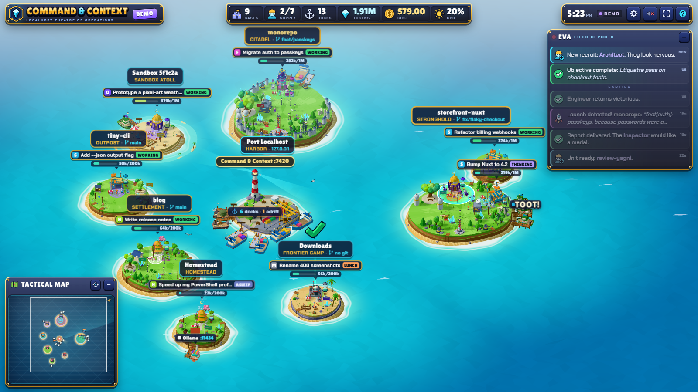
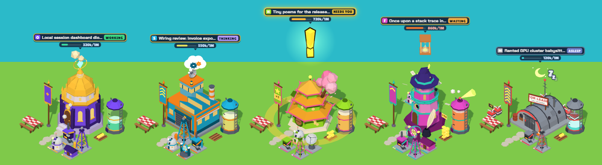
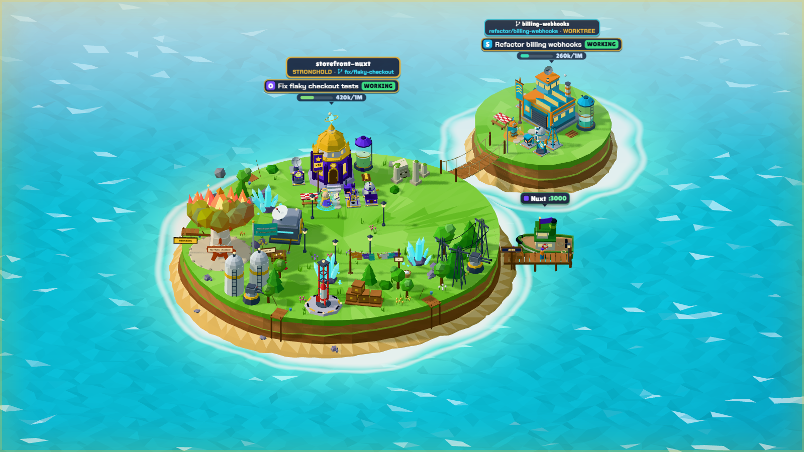
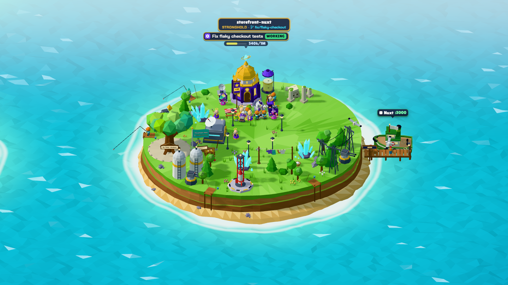
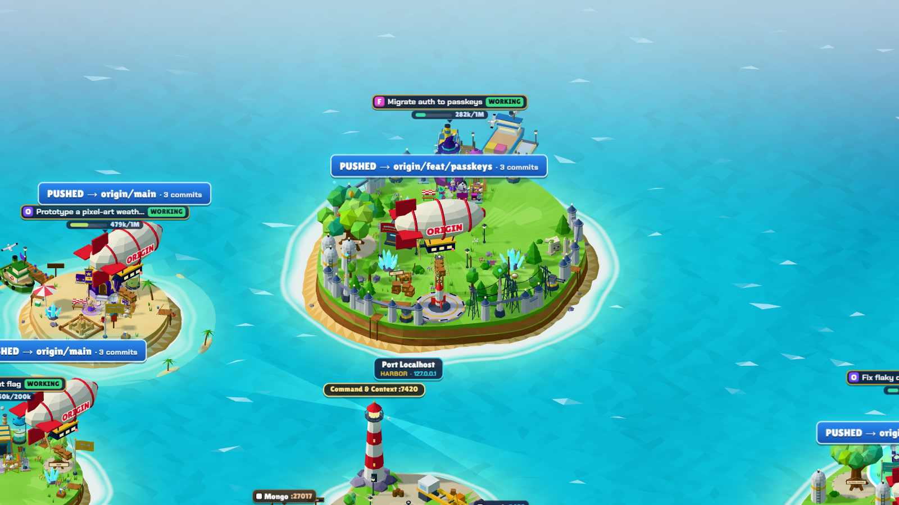
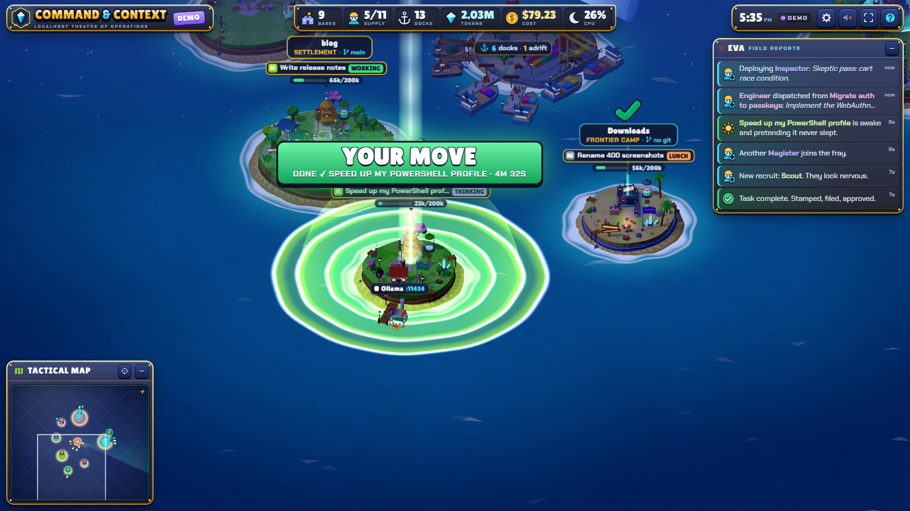
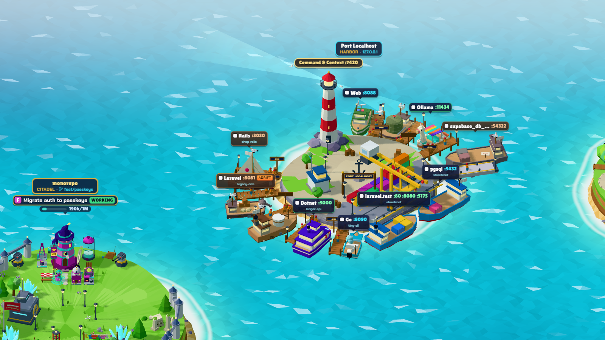
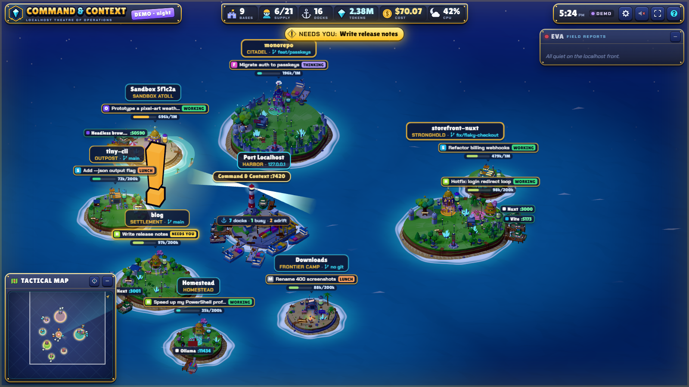
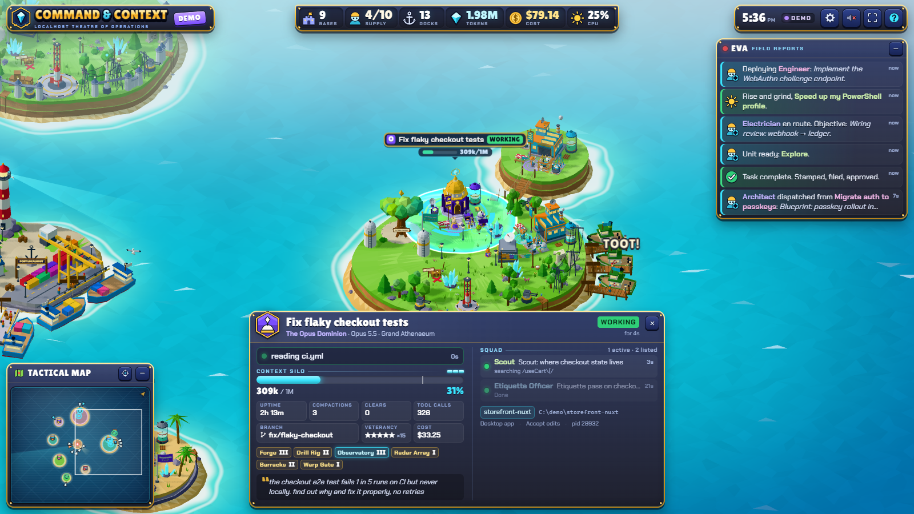

# COMMAND & CONTEXT

*Localhost Theatre of Operations.* A low-poly, isometric RTS diorama of every Claude Code session running on
this machine, plus their sub-agents, processes and dev-server ports. It's made for a spare monitor.

**[▶ Try the web demo](https://geekgreg.github.io/command-and-context/)** (a simulated world, right in your browser) ·
`npx command-and-context` to watch your own sessions.



Repos are islands. Sessions are bases. Sub-agents are workers who walk out of the base, do their jobs, and go
back inside when they're done. Listening ports are docks with stubby little boats that rust when nobody visits.
When everyone is idle, they have lunch.

---

## Quick start

You need [Node.js 20+](https://nodejs.org) and [Claude Code](https://claude.com/claude-code). Then:

```bash
npx command-and-context
```

That starts the server on http://localhost:7420 and opens the dashboard (a chromeless Edge window on Windows,
your browser elsewhere). Drag the window to your spare monitor and press **F11**. Add `--demo` for a simulated
world that shows off every animation, or install it for good with `npm install -g command-and-context` and run
`command-and-context`.

**From a clone** (Windows): double-click **`Command and Context.cmd`**. The first run installs three.js; the
launcher then starts the server minimized and opens the dashboard window. Or `npm install`, then `npm start`
(server only) or `npm run demo`.

**Platforms.** Windows 10/11 is the main platform: the process and port probe uses the built-in Windows
PowerShell. macOS and Linux fall back to `ps` + `lsof` and are experimental (no weather, fewer harbor
details). `git` and `docker` on your PATH are optional: they light up the git features and container ships.
Claude Code sessions inside WSL aren't visible to a dashboard running on Windows yet.

`?demo&speed=4` fast-forwards the demo. `?demo&scene=buildings|units|harbor|git|night|empty` pins a tableau.

## How it knows what's running

Claude Code keeps a live registry of its running processes in `~/.claude/sessions/<pid>.json`. That covers the
desktop app, the CLI and IDE sessions. The dashboard shows a base only while that process is actually alive,
and it checks the process start time so a recycled PID can't fool it. The long tail of old conversations in the
desktop sidebar never appears.

Live processes can still sit untouched for days, so time does the rest:

| Idle for | What you see |
|---|---|
| a moment | **Lunch break**: the commander sits at the picnic table |
| 20 min | **Asleep**: lights out, Zzz, a little moon; cobwebs after a few hours |
| 4 h asleep | the base **leaves the map** (it comes back the moment the session does anything) |

A base with running sub-agents or a dev server stays on the map, whatever its idle time. When a session's process
exits, the base is **decommissioned**: CLOSED sign, lights off, and it sinks into the ground. Tune these times
with `--asleep-after` and `--hide-after`.

**/clear vs. compaction.** A `/clear` keeps the same desktop session but starts a new session id. That triggers a
**controlled demolition**: dynamite, flying debris, a dust cloud, then a fresh base rises from scaffolding. A
**compaction** is detected from the transcript's compaction markers, or from a sudden context collapse. A
hydraulic press slams the context silo and a glowing *Summary Brick* joins the pile beside it.

---

## Field manual

### The factions (one per model family)



| Model | Faction | Headquarters | Workers |
|---|---|---|---|
| Opus | **The Opus Dominion**: slow, deliberate, expensive | Grand Athenaeum (golden dome, floating crystal) | Magisters: robed, haloed, waddle |
| Sonnet | **Sonnet Heavy Industries**: union rules require lunch | Command Works (radar dish, hangar door) | Engineers: hard hats, lunch pails on an I-beam |
| Haiku | **The Haiku Swarm**: small, fast, seventeen syllables | Blossom Hive (pagoda + cherry tree) | Sprites: hop everywhere, speak only in haiku |
| Fable | **The Fable Guild**: every commit is a story | Storyteller's Spire (wizard hat, giant quill) | Scribes: hooded, floating, sparkly |
| anything else | **Freelancers** | Rented Hangar (FOR LEASE) | Drones |

A sub-agent's faction follows *its* model, so an Opus reviewer can walk out of a Fable tower.

### Islands (repos)

- **Size = repo size** (tracked files): Outpost → Settlement (fences, lamps) → Stronghold (turrets, pylons,
  silos) → Citadel (walls, spires, spaceport).
- **The Git Tree** stands at the island's edge, leaving the middle clear for the workers. It has one big branch
  per local git branch, with the current branch on a sign. Repos with more than 1,500 commits get **Legacy Ruins**.
- **Git activity** (checked every ~10 s):
  - **Commit**: a rocket (a firework on small islands) launches with your commit message.
  - **Push**: an airship stenciled with the remote's name ("ORIGIN") lifts off with one crate per commit
    pushed. A branch's first push is a *maiden voyage*.
  - **Merge**: two ribbons of light spiral out of the Git Tree and fuse into a golden burst.
  - **Pull** (a fast-forward to new commits): supply crates parachute in.
  - **Checkout**: the banner flag lowers and rises with the new branch.
  - **Pull request** (opened, edited or merged by a session): a carrier pigeon takes off from that base with a
    "PR #123" scroll, circles once and heads for the horizon. Merged ones get a ✓ and confetti, so a PR opened
    and then merged in the same session sends two pigeons (follow-up edits send none). The session's card
    lists its PRs.
- **Work-tree state** (a read-only `git status` about every 15 s):
  - **Uncommitted files**: laundry on a line, one garment per file (up to 8, then a "+N" tag). It flaps harder
    when the weather is windy.
  - **Unpushed commits**: crates stack on a pallet by the launch pad. A push loads them into the airship.
  - **A stash**: a treasure chest half-buried behind a red X, with a "STASH ×N" sign.
  - **A merge, rebase, cherry-pick, revert or bisect stopped half-way**: the Git Tree in a plaster cast, with a
    "REBASING" (etc.) sign.
  - **Merge conflicts**: the Git Tree is on fire, fiercer with more conflicted files.
  - The island's card has the numbers (including behind the upstream). Worktree islets show only the fire and
    the cast.



- **Git worktrees** are little annex islets joined by a rope bridge.
- Not a git repo? That's a **Frontier Camp**: tents, a campfire, and a sign that says *HERE BE DRAGONS: no
  version control*. Sometimes there's a sea serpent. Claude's scratch workspaces become **Sandbox Atolls**.
- **Port Localhost** in the middle is the harbor town. Its **lighthouse is this dashboard**.





### Bases (sessions)

Each base grows **add-on modules** from the tools its session uses (3 uses to build, 25 and 100 to upgrade).
No two bases end up alike. A module animates while its tool is in use:

| Tool | Module |
|---|---|
| Edit / Write | **Forge**: robotic hammer, sparks |
| Bash / PowerShell | **Drill Rig**: pumping derrick |
| Read / Grep / Glob | **Observatory**: rotating telescope |
| Web fetch / search / browser | **Radar Array**: scanning dish |
| Agents | **Barracks**: flapping door |
| MCP tools | **Warp Gate**: swirling ring |

- **Context Silo**: fill level = context window used (cyan → red). Above 80% it bulges, steams, and spins a
  warning light.
- **Summary Bricks** = compactions. **Gold stars on the banner** = sub-agents that finished their missions.
- **Generator huts** = processes the session is running (spin speed = CPU).
- **Giant yellow "!"** (with one big energy pulse across the sea when it appears) = the session **needs
  you**: a question, a plan to approve, or probably a permission prompt (on Windows that includes a shell
  command held for approval). It stays until you answer. The top bar also shows a
  **NEEDS YOU** pill; click it to fly there.
- **Pillar of light + shockwaves + "YOUR MOVE"** = the main agent just finished its turn and handed control
  back to you. A green ✓ then hovers over the base until it gets busy again or falls asleep. If sub-agents
  are still out, the banner reads "WAITING ON n AGENTS" instead, and the ✓ waits until they're all back.
- Gears = thinking. Hourglass = waiting on a long command.



### Commanders (the main agent)

Every base has a hero unit: the session's main agent. It works as a **spellcaster**, standing at its post in
front of the base inside a glowing rune circle and flinging spell bolts at the module it's using. The circle's
colour is the tool: orange edit, cyan shell, violet read/search, teal web, gold agents, magenta MCP. Each
faction casts in its own style (golden glyphs, holograms, cherry petals, wand sparkles, electric arcs).
When the session is idle, the commander goes to lunch.

### Workers (sub-agents)

The agent type sets the role and its prop:

| Agent type | Role |
|---|---|
| Explore / recon | Scout (binoculars) |
| Plan | Architect (blueprints) |
| review-yagni | YAGNI Inspector (an axe) |
| review-runtime-wiring | Electrician |
| review-house-conventions | Etiquette Officer (monocle, rulebook) |
| review-design-fidelity / UI | Painter |
| other reviewers / audits | Inspector (clipboard, magnifier) |
| tests | Tester · docs/guides: Librarian · security: Guard · debugging: Exterminator |
| everything else | Engineer (wrench) |

The current tool sets what they do: **Bash** = mining token crystals, **Edit** = hammering, **Read** = reading
scrolls at the Archive, **Grep/Glob** = metal detecting, **Web** = fishing off the shore, **MCP** = a chunky old
telephone, **spawning agents** = megaphone. Finished workers celebrate and walk home (reviewers stamp
**APPROVED**). Failures trudge home under a tiny rain cloud. Sub-agents of sub-agents are apprentices who tag
along behind their parent.

Click a worker for a quote. Click it a lot for a different kind of quote.

### Harbor (ports)

Every listening dev port gets a dock and a boat. Node gets a tugboat, Python a paddle steamer, PHP a barge with
an elephant figurehead, Ruby a sloop, Java a freighter with a coffee mug, Go a speedboat, and databases a
tanker. A Docker container gets a container ship, and a headless test browser gets a yellow submarine. The flag
shows which session started the server. Boats dock at their repo's island, or at Port Localhost if no session
owns them.

- **Busy**: the boat **goes fishing**. Activity comes from the server's network and disk traffic, so a
  single page load is enough. It casts off, trawls a lane of open water off its dock, and lands a fish for
  every new burst of traffic. After about 35 quiet seconds it sails home, and the stevedores unload the
  catch. Container ships make delivery runs, and the submarine cruises underwater and surfaces on catches.
- **Idle**: stevedores nap. Over hours the boat rusts, lists, collects barnacles and a seagull, and finally gets
  a hand-painted "4 SALE" sign. Traffic returns → fresh paint.
- **Adrift**: a server nobody is tending flies a torn, bleached flag, drifts off its berth and strains at its
  mooring line. That's either a server whose session has ended, or a dev server whose launcher is gone and that
  was probably left behind by a Claude session that has since ended: one that was working in that folder when
  the server started (the usual leftover of `npm run dev &`). Servers you start yourself (from a `.cmd` with
  `start`, `Start-Process`, pm2, ...) aren't flagged unless a Claude session was working in that folder at the
  time, and this dashboard never is. Its label says ADRIFT, the tactical map draws it orange, and its card says
  why (naming the session that probably left it) and for how long, with a `Stop-Process -Id <pid>` line to
  copy. The dashboard never runs it for you.
- **Crowded harbors**: when a harbor has 5 or more boats and you aren't zoomed in, their labels fold into one
  tag, e.g. `⚓ 11 docks · 2 busy · 1 adrift`. Hover it to peek at the boats; click it to zoom in.



### Weather

The whole-machine CPU load is the weather. Calm seas, then wind, then a storm with rain and lightning when your
CPU is pegged. Day and night follow your clock.



### The HUD

- **Top bar**: bases, supply (running/listed agents), docks, total context tokens, cost, CPU.
- **Tactical map**: click or drag to move.
- **EVA field reports**: click a line to fly to it. A NEEDS YOU line stays (outlined) until that session no
  longer needs you. Harbor comings and goings less than 15 s apart share one line. After sleep, an outage or a
  server restart, what you missed appears as dimmed lines under *while you were away*.
- **Voice**: an optional announcer (off by default). Browsers block speech until the page has had a click;
  when that happens the voice button turns amber, and your next click or key press brings it back.
- **Connection light**: LIVE dims and blinks slowly when no update has arrived for 12 s, and the page
  reconnects at once after the PC wakes.
- **Click anything** for its card: session details, last prompt, squad, processes, ports.
- **Settings** (gear): labels, day/night, *director mode* (the camera tours the map when you're not touching
  it and pans to big events), voice, quality, frame rate (30 fps by default for an always-on screen), and more.

**Keys:** `F` fit · `Q`/`E` rotate · `+`/`-` zoom · arrows pan · `Space` latest event · `H` hide HUD ·
`L` labels · `Esc` deselect · `D` `D` demo on/off (press twice) · `?` help.



---

## Configuration

| Flag | Default | |
|---|---|---|
| `--port <n>` | 7420 | also `CNC_PORT` |
| `--open` / `--app` | | open in the browser / as an app window (`npx` does this by default) |
| `--no-open` | | just run the server |
| `--demo` | | open in demo mode |
| `--asleep-after <min>` | 20 | idle minutes before a base sleeps |
| `--hide-after <h>` | 4 | hours asleep before a base leaves the map |
| `--all-ports` | off | also show ports of ordinary desktop apps |
| `--no-prompts` | off | never send prompt text to the browser (untitled sessions are named after their folder) |
| `--dump` | | print one world snapshot as JSON and exit |
| `--config <file>` | | read settings from a JSON file |
| `--claude-dir <dir>` | `~/.claude` | Claude Code's config folder (also `CLAUDE_CONFIG_DIR`) |

The same keys (`port`, `asleepAfterMin`, `hideAfterHours`, `showAllPorts`, `ignorePorts`, `showPrompts`,
`contextWindows`) can go in a settings file: `%APPDATA%command-and-contextconfig.json` on Windows,
`~/.config/command-and-context/config.json` elsewhere, a `config.json` next to `package.json` in a clone, or
any file passed with `--config`. For example `{ "hideAfterHours": 1, "ignorePorts": [5037] }`.

**Start with Windows:** press Win+R, type `shell:startup`, and drop a shortcut there to `Command and Context.cmd`
(from a clone), or create one whose target is `cmd /c npx command-and-context`.

## Privacy & safety

- It binds to `127.0.0.1` only and rejects requests whose Host header isn't localhost (DNS-rebinding guard).
- It reads the Claude Code transcripts and the session registry. It never reads `.credentials.json` or the
  registry's `.key` files. Prompt text only appears in the selection card (turn it off with `--no-prompts`).
- Command lines, search patterns and web search queries have anything that looks like a token, password or
  key redacted.
- The Windows probe reads the command line and working directory of dev-tool processes (node, python, bash, …)
  and of anything Claude started. It never opens system processes.

## Troubleshooting

- **Port 7420 is busy**: it's probably already running; the launcher just opens it. Otherwise use `--port`.
- **No ports or boats**: the process probe needs Windows PowerShell 5.1 (built into Windows). Check the
  server window for `system probe` warnings.
- **Docker ships missing**: the `docker` CLI must be on your PATH, and Docker Desktop must be running.
- **macOS / Linux**: the collector falls back to `ps` + `lsof`. That path works but gets less testing than
  the Windows one.
- `npm run probe` (`--dump`) prints exactly what the server sees.

## Hacking on it

- `server/`: the collector (session registry, transcript tailing, the process/port probe, git, docker) and the SSE server.
- `public/js/world/`: `engine` (renderer, camera, sky, sea, fx, labels), `world` (snapshot diffing and
  orchestration), `islands`, `buildings`, `units`, `harbor`.
- `public/js/hud/`: the RTS chrome. `public/js/demo.js`: the simulated world.
- `public/dev/*.html`: standalone harness pages for islands, buildings, units and the harbor.
- `docs/DESIGN.md`: the full design spec and data contract.
- `tools/shot.ps1`: headless screenshot helper.
- `tools/build-site.mjs`: builds the web demo; `.github/workflows/pages.yml` publishes it to GitHub Pages on
  every push to `main`.

## License

[MIT](LICENSE). Command & Context is a fan-made tool; it isn't affiliated with Anthropic.

*Construction complete.*
